# Mermaid Cheatsheet

## 流程图 (Flowchart)

### 方向
```mermaid
graph TD  # Top Down
graph LR  # Left Right
graph BT  # Bottom Top
graph RL  # Right Left
```

### 基本形状
```mermaid
graph TD
    A[矩形] --> B(圆角矩形)
    B --> C{菱形/判断}
    C --> D[/平行四边形/]
    C --> E[[圆柱体/数据库]]
    C --> F[(圆形)]
    C --> G>{{六边形}}
```

### 示例
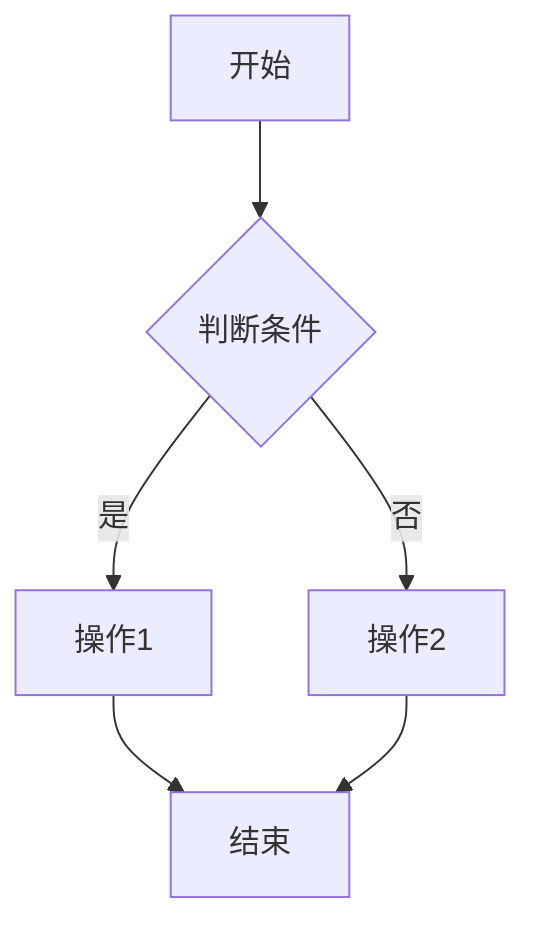

## 时序图 (Sequence Diagram)

### 基本语法
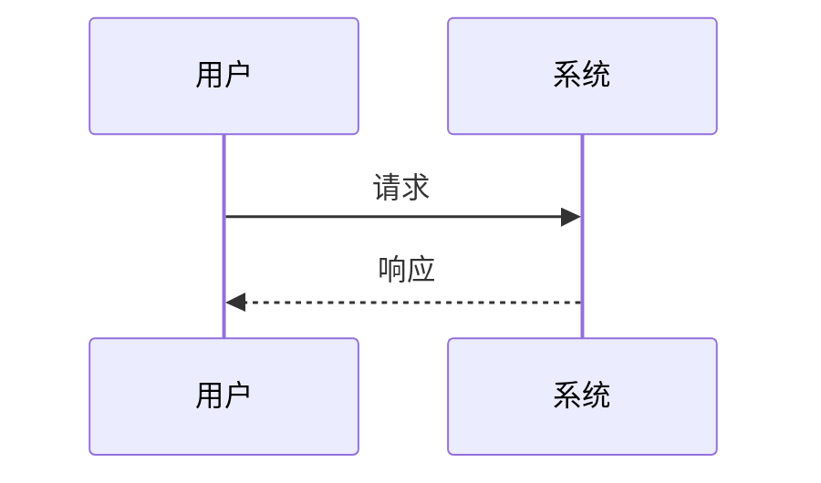

### 箭头类型
| 类型 | 语法 | 说明 |
|------|------|------|
| 实线 | `->` | 同步调用 |
| 虚线 | `-->` | 异步消息 |
| 实线带开叉 | `->>` | 返回消息 |
| 虚线带开叉 | `-->>` | 异步返回 |

### 示例
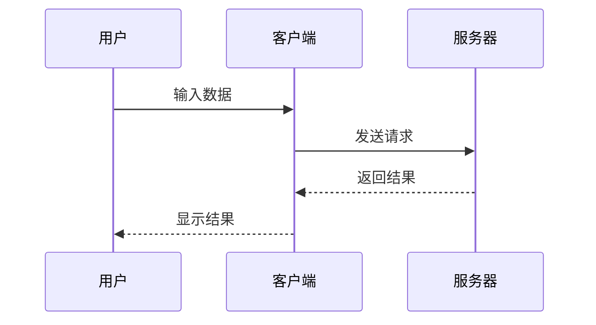

## 状态图 (State Diagram)

### 基本语法
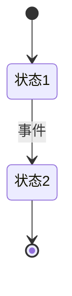

### 示例
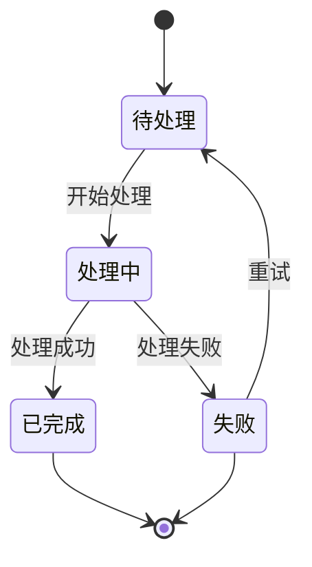

## 类图 (Class Diagram)

### 基本语法
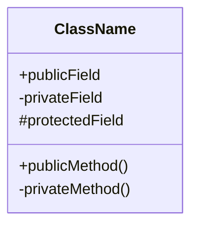

### 关系类型
| 类型 | 语法 |
|------|------|
| 继承 | `<|--` |
| 组合 | `*--` |
| 聚合 | `o--` |
| 关联 | `-->` |
| 依赖 | `..>` |

### 示例
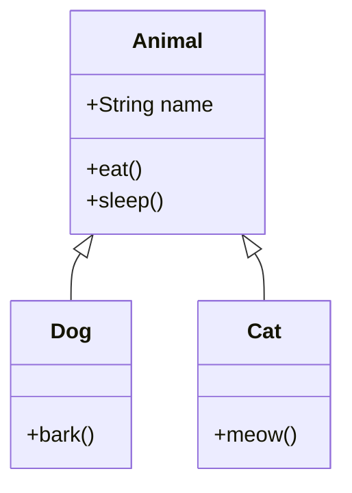

## 实体关系图 (ER Diagram)

### 基本语法
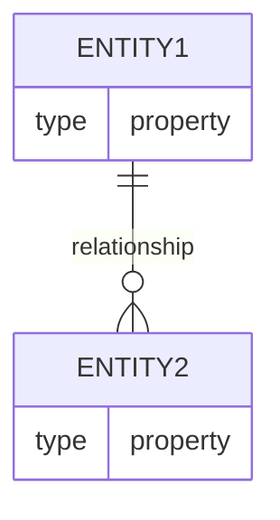

### 示例
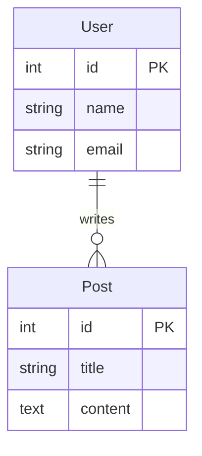

## 甘特图 (Gantt Chart)

### 基本语法
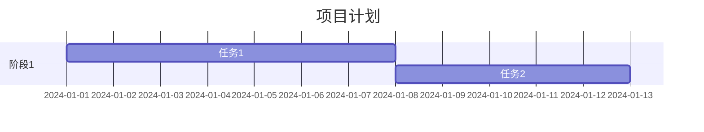

### 示例
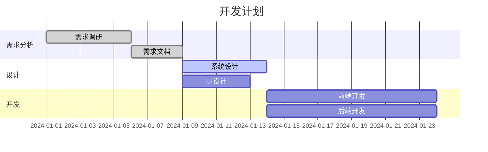

## 饼图 (Pie Chart)

### 基本语法
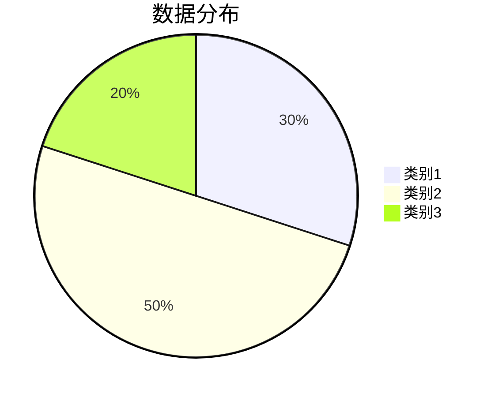

## 常用样式

### 样式定义
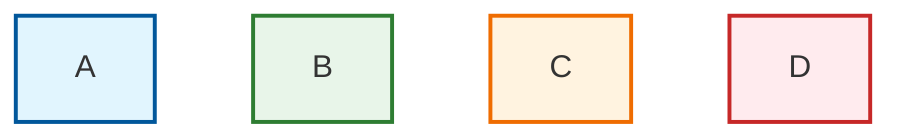

### 子图
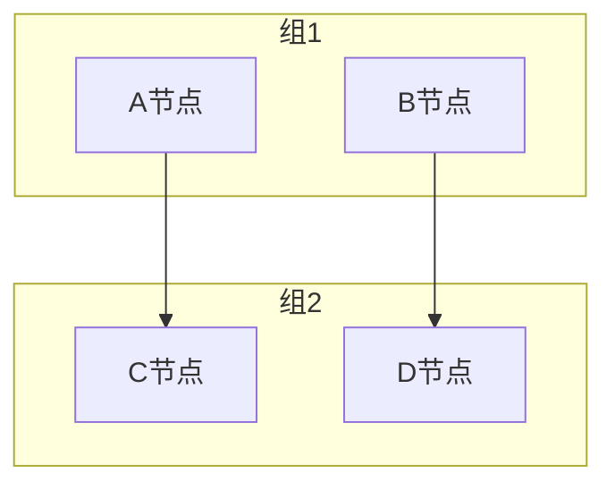

## 最佳实践

1. **节点命名**：使用简洁清晰的标识符
2. **布局控制**：适当使用方向和换行符控制布局
3. **样式一致**：统一样式定义，保持视觉一致
4. **注释说明**：添加title和说明文字
5. **复杂度控制**：过于复杂的图表考虑拆分
